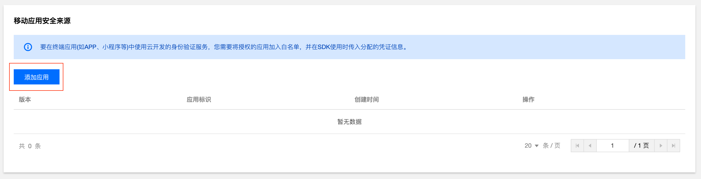

summary: BlossomAccents开发过程
id: first_codelab
categories:Android
tags: android
status: Published 
authors: milox
Feedback Link: https://github.com/1021048313/imd_final_project

# BlossomAccents开发过程 

<!--1-->

## 设计

Duration: 10

### 功能列举

设计的几个重点模块列举如下：

- 登录/注册
- 主页查看集合列表
- 用名字来搜索集合
- “我的”列举该用户所创建的集合
- 创建者删除和修改集合名
- 修改用户名和头像

### 数据库

#### 配置

cloudbase的数据库，目前先采用按需计费

> 云开发推出了 Flutter SDK，在 iOS、Android 等移动应用平台中集成，可以方便使用云函数、云存储等能力。
>
> cloudbase自带的云数据库支持：基础读写、聚合搜索、数据库事务、实时推送；
>
> 云存储可以支持音频；

#### user

##### 内容

昵称userName、邮箱userEmail、密码userPwd、头像userImg，以及userId

##### 操作 

- 增：用户注册
- 查：查找用户名和密码用于登录、用userId查剩余值
- 改：修改头像和用户名

#### collection

##### 内容

作者UserId、名称header、字典个数wordCount、词典列表audioList，以及集合id

注：这一部分的数据库设计有问题，需要再修改

##### 操作

- 增：用户创建集合
- 删：作者删除集合
- 查：主页显示全部、根据用户找集合、根据标题关键词找集合、根据集合id找到对应的内容
- 改：增加audioList，作者修改集合名字

清楚设计内容之后进入编写，由于起初的设计仍有欠缺，编写代码过程中有若干修改，**本报告中的编写部分不是以实际编写顺序进行的**，如果有部分报告缺漏请告诉我。

<!-- 2  -->

## 创建项目

Duration: 10

### 环境配置

#### 开发环境

0. 由于cloudbase不支持最新版本flutter的空安全，所以采用最高2.10.0的版本（本项目用的是2.10.0）。开发过程中用到的依赖包也主要是看没有`null safety`的版本。
1. 下载flutter sdk [根据版本](https://flutter.dev/docs/development/tools/sdk/releases) 并配置
2. 使用android studio开发（其它软件也行），参考as配置flutter的教程走就行
3. 只要第一个示例程序可以运行就没啥大问题

#### 运行环境

1. 开发过程中使用的测试工具是安卓手机模拟器
2. 实际运行需要最低sdk 23的安卓手机

### 新建项目

创建Flutter Application Project，命名为`blossom_accents`，包名为`com.imd.blossomaccents`。

新建完成后测试是否可以运行，我的gradle运行失败，参考这个[stackoverflow上的解决方案](https://stackoverflow.com/questions/62315496/gradle-could-not-initialize-class-org-codehaus-groovy-runtime-invokerhelper)

### 项目结构

进入默认项目文件夹，在lib文件夹下有`main.dart`。本项目的代码经过整理后分入若干个文件夹中，列举如下：

- /cloudbase 云存储和云数据库的登录、操作等
- /common 全局用到的变量以及sharedPreferences
- /models 存放类
- /pages 放页面
- /routers 路由管理
- main.dart主函数

### 效果展示

页面设计我尽力了。如果配色辣眼睛……实在不好意思


<!--3-->

## cloudbase登录

Duration: 10

*在开发过程中看到的打包工具，有机会试一试[CloudBase 快速开发工具](https://pub.dev/packages/cloudbase)* 

主要参考：[腾讯cloudbase文档](https://cloud.tencent.com/document/product/876/51930)

### 添加依赖

在项目的`pubspec.yaml`，添加到`dependencies`

```yaml
cloudbase_core: ^0.0.9
cloudbase_auth: ^0.0.11
cloudbase_storage: ^0.0.3
cloudbase_database: ^0.0.10
```

其中core、auth用于登录，storage是云存储（放用户头像、放音频），database就是数据库。

添加完之后运行Pub get

### 创建凭证

创建移动应用安全来源的凭证

打开 [安全设置页面](https://console.cloud.tencent.com/tcb/env/safety) 中，在移动应用安全来源里**添加应用**：



> 因为 Flutter 是跨端开发框架, 所以需要为 Android 和 iOS 各申请一个应用凭证。 应用标识应该是 Android 包名 和 iOS Bundle ID

在本项目只要安卓的包名`com.imd.blossom_accents`即可。

### 匿名登陆

在 [环境设置页面](https://console.cloud.tencent.com/tcb/env/login) 中，单击“登录方式”，然后**启用匿名登录**


### 登录

在cloudbase文件夹下写登录，并初始化几个表（在另外的文件中声明，后面会详细说）

```dart
//CloudBaseLogin.dart
class CloudBaseLogin{
  Future<bool> login() async{
    WidgetsFlutterBinding.ensureInitialized();
    // 初始化 CloudBase
    CloudBaseCore core = CloudBaseCore.init({
      // 填写您的云开发 env
      'env': '',
      // 填写您的移动应用安全来源凭证
      // 生成凭证的应用标识必须是 Android 包名或者 iOS BundleID
      'appAccess': {
        // 凭证
        'key': '',
        // 版本
        'version': ''
      }
    });
    // 获取登录状态
    CloudBaseAuth auth = CloudBaseAuth(core);
    CloudBaseAuthState authState = await auth.getAuthState();

    // 唤起匿名登录
    if(authState==null){
      await auth.signInAnonymously().then((success) {
        // 登录成功
        print("登陆成功！！");
        return true;
      }).catchError((err) {
        // 登录失败
        print(err);
        return false;
      });
    }
    //初始化数据库、存储
    db = CloudBaseDatabase(core);
    userCollection= db.collection('user');
    listCollection=db.collection('list');
    storage = CloudBaseStorage(core);
    return true;
  }
}
```

初始化 CloudBase 时用到的 `appAccess` 参数可以从控制台的安全来源凭证模块中获取。

环境id就是购买的这个环境的id，一般在控制台列举的环境那可以找到。


<!--4-->

## cloudbase使用

Duration: 10

### 变量声明

```dart
//Tables.dart
//用户表
Collection userCollection;
//集合表
Collection listCollection;
//单个表
Collection audioCollection;
//存储
CloudBaseStorage storage;
//数据库（后面有用command）
CloudBaseDatabase db;
```

### 数据库

按照对应的表，分成两个文件

#### 集合表

```dart
//CollectionTable.dart
class CollectionTable {
  //新建集合
  Future<String> addCollection(String header,  int time) async {
    var a=await listCollection.add({
      'header': header,
      'time': time,
      'userId': curUserId,
      'wordCount': 0,
      'audioList':[]
    });
    return a.id;
  }
  //删除集合
  deleteCollection(String listId) async{
    await listCollection.doc(listId).remove();
  }
  //修改名字
  modifyCollectionName(String listId,String newName) async{
    print(newName);
    print(listId);
    var a=await listCollection.doc(listId).update({
      'header':newName
    });
    print(a);
  }
  //查找目前的集合-home
  //后面的查找功能类似，具体可以直接看代码
  Future<List<ListClass>> getIndexList() async {
      List<ListClass> resultListItems = new List<ListClass>();
      var value=await listCollection.orderBy("time", "desc").get();
      var v = value.data;
      for (var data in v) {
        String header = data['header'];
        int wordCount = data['wordCount'];
        String userId = data['userId'];
        String listId=data['_id'];
        String authorName=await UserTable().getUserNameById(userId);
        resultListItems.add(ListClass(header,userId, wordCount, authorName,listId));
      }
      return resultListItems;
  }
}
```

#### 用户表

```dart
//UserTable.dart
class UserTable{
  //根据Id找用户
  Future<String> getUserNameById(String userId) async{
    var value=await userCollection.doc(userId).get();
    return value.data[0]['userName'];
  }
  //注册用户，有默认值
  Future<bool> addUserWhenRegister(String userPwd,String userEmail) async {
    await userCollection.add({
      'userPwd': userPwd,
      'userEmail': userEmail,
      'userName':"起个名字呗",
      'userImg':"https://wx3.sinaimg.cn/mw690/008gNS3Fly1grtq4s6vn7j30c20c4tj4.jpg"
    })
        .then((res) {
      return true;
    })
        .catchError((err) {
      print(err);
      return false;
    });
  }
  //设置头像
  setUserImg(String imgPath) async{
    await userCollection.doc(curUserId).update({
      'userImg':imgPath
    });
  }
  //修改用户名
  setUserName(String name) async{
    await userCollection.doc(curUserId).update({
      'userName':name
    });
  }
}
```

### 存储

```dart
//storage_method.dart
class StorageMethod{
    //上传音频
  Future<String> audioUpload(String filePath,String fileName) async {
    var res=await storage.uploadFile(
        cloudPath: 'userAudios/'+fileName+'.aac',
        filePath: filePath,
    );
    return res.data.fileId;
  }
//上传头像
  Future<String> avatarUpload(String imagePath) async{
    var res=await storage.uploadFile(
      cloudPath: 'userImgs/'+curUserId+'.png',
      filePath: imagePath,
    );
    return res.data.fileId;
  }
//下载音频
  audioDownload(String cloudPath,String localPath) async{
    await storage.downloadFile(
        fileId: cloudPath,
        savePath: localPath,
    ).catchError((onError)=>print(onError));
  }
}
```

<!--5-->

## common

Duration: 10

#### 全局变量和操作

```dart
//application.dart
//登录和注册时用的
Map<String,String>mockUsers={};
//路由
FluroRouter router=new FluroRouter();
//sharedPreferences用的key
const USER_LOGIN="user-login";
const USER_EMAIL="user-email";
//保存登录信息
String curUsername;
String curUserEmail;
String curUserImg;
String curUserId;
//加载时间
Duration get delayTime => Duration(milliseconds: timeDilation.ceil() * 4250);
//toast
void toast(String msg){
  Fluttertoast.showToast(
  );
}
//检查文件夹存在
folderExists(String filepath) async {
  var file = Directory(filepath);
  try {
    bool exists = await file.exists();
    if (!exists) {
      await file.create();
    }
  } catch (e) {
    print(e);
  }
}
//颜色
const Color color1 = Color(0xfff1f3f6);
const Color color2 = Color(0xff366471);
const Color color3 = Color(0xff3e6a77);
const Color color4 = Color(0xff6c909b);
const Color color5 = Color(0x4d3754AA);
const Color color6 = Color(0xFF5247BA);
const Color color7 = Color(0xFFF1E6FF);
```

#### SharedPrefences

```dart
//shared_utils.dart
import 'package:blossom_accents/common/application.dart';
import 'package:shared_preferences/shared_preferences.dart';
//加
sharedAddData(String key,Object dataType,Object data) async{
  SharedPreferences prefs=await SharedPreferences.getInstance();
  switch(dataType){
    case bool:
      prefs.setBool(key, data as bool);break;
    case double:
      prefs.setDouble(key, data as double);break;
    case int:
      prefs.setInt(key, data as int);break;
    case String:
      prefs.setString(key, data as String);break;
    case List:
      prefs.setStringList(key, data as List<String>);break;
    default:
      prefs.setString(key, data as String);break;
  }
}
//返回
Future<Object> sharedGetData(String key) async{
  SharedPreferences prefs=await SharedPreferences.getInstance();
  return prefs.get(key);
}
//清除当前登录信息（用于退出登录）
Future<void>sharedDeleteAll() async{
  SharedPreferences prefs=await SharedPreferences.getInstance();
  prefs.remove(USER_EMAIL);
  prefs.remove(USER_LOGIN);
}
```

<!--6-->

## models

Duration: 3

为了方便传递对象的信息，本项目中写了两个类

```dart
//ListClass.dart
class ListClass {
  String header;
  int wordCount;
  String userId;
  String listId;
  String authorName;
  ListClass(String header,String userId,int wordCount,String userName,String listId){
    this.header=header;
    this.userId=userId;
    this.wordCount=wordCount;
    this.listId=listId;
    this.authorName=userName==null?"还没取名字":userName;
    this.listId=listId;
  }
}
```

```dart
//RecordClass.dart
class RecordClass{
  String filePath;
  String explain;
  RecordClass(String filePath,String explain){
    this.filePath=filePath;
    this.explain=explain;
  }
}
```

<!--7-->

## Pages-登录注册

Duration: 10

### welcome

在pages中新建welcome文件夹。

welcome主要就是页面跳转

#### 主页面

```dart
//welcome_screen.dart
import 'package:flutter/material.dart';
import 'body.dart';
class WelcomeScreen extends StatelessWidget {
  @override
  Widget build(BuildContext context) {
    return Scaffold(
      body: Body(),
    );
  }
}
```

#### 背景

```dart
//background.dart
class Background extends StatelessWidget {
  final Widget child;
  const Background({
    Key key,
    @required this.child,
  }) : super(key: key);
  //自己整了个背景图，就直接放外链得了
  @override
  Widget build(BuildContext context) {
    Size size = MediaQuery.of(context).size;
    return Container(
    );
  }
}
```

#### body

```dart
//body.dart
class Body extends StatelessWidget {
  @override
  Widget build(BuildContext context) {
    //屏幕尺寸
    Size size = MediaQuery.of(context).size;
    return Background(
    );
  }
}

```

### login

login需要给sharedPreferences增加内容，以及检验用户是否存在、用户邮箱和密码是否匹配。

#### 主页面

```dart
//login_screen.dart
class LoginScreen extends StatelessWidget {
  static const routeName = '/login';
  @override
  Widget build(BuildContext context) {
    return Scaffold(
      body: Body(),
    );
  }
}
```

#### 背景

```dart
//background.dart
class Background extends StatelessWidget {
  final Widget child;
  const Background({
    Key key,
    @required this.child,
  }) : super(key: key);
  @override
  Widget build(BuildContext context) {
    Size size = MediaQuery.of(context).size;
    return Container(
    );
  }
}
```

#### body

```dart
//body.dart

class Body extends StatelessWidget {
  const Body({
    Key key,
  }) : super(key: key);

  //Login按钮功能
  Future<String> _loginUser(String userEmail,String userPwd) {
    return Future.delayed(loginTime).then((_) async {
      //检查登录
      if (!mockUsers.containsKey(userEmail)) {
        return '用户不存在';
      }
      if (mockUsers[userEmail] != userPwd) {
        return '密码不正确';
      }
      //给sharedPrefs增加内容
      return null;
    });
  }

  @override
  Widget build(BuildContext context) {
  }
}

```

### signup

在pages中新建signup文件夹。

signup需要检验两次密码的一致性。

可以拓展的部分：增加邮箱验证

#### 主页面

```dart
//signup_screen.dart
class SignUpScreen extends StatelessWidget {
  @override
  Widget build(BuildContext context) {
    return Scaffold(
      body: Body(),
    );
  }
}

```

#### 背景

```dart
//background.dart
class Background extends StatelessWidget {
  final Widget child;
  const Background({
    Key key,
    @required this.child,
  }) : super(key: key);
  @override
  Widget build(BuildContext context) {
  }
}

```

#### body

```dart
//body.dart
class Background extends StatelessWidget {
  final Widget child;
  const Background({
    Key key,
    @required this.child,
  }) : super(key: key);

  @override
  Widget build(BuildContext context) {
  }
}

```

### 组件

主要是这三部分用到的公用组件，它们的功能通过文件名就可以清楚

```dart
//already_have_an_account.dart
class AlreadyHaveAnAccountCheck extends StatelessWidget {
  final bool login;
  final Function press;
  const AlreadyHaveAnAccountCheck({
    Key key,
    this.login = true,
    this.press,
  }) : super(key: key);

  @override
  Widget build(BuildContext context) {
  }
}
```

```dart
//rounded_button.dart
class RoundedButton extends StatelessWidget {
  final String text;
  final Function press;
  final Color color, textColor;
  const RoundedButton({
    Key key,
    this.text,
    this.press,
    this.color = color6,
    this.textColor = Colors.white,
  }) : super(key: key);

  @override
  Widget build(BuildContext context) {
  }
}
```

```dart
//rounded_button.dart
class RoundedButton extends StatelessWidget {
  final String text;
  final Function press;
  final Color color, textColor;
  const RoundedButton({
    Key key,
    this.text,
    this.press,
    this.color = color6,
    this.textColor = Colors.white,
  }) : super(key: key);

  @override
  Widget build(BuildContext context) {
  }
}
```

```dart
//rounded_password_field.dart
class RoundedPasswordField extends StatelessWidget {
  final ValueChanged<String> onChanged;
  RoundedPasswordField({
    Key key,
    this.onChanged,
  }) : super(key: key);
  bool visible=true;

  @override
  Widget build(BuildContext context) {
  }
}

```

```dart
//text_field_container.dart
class RoundedButton extends StatelessWidget {
  final String text;
  final Function press;
  final Color color, textColor;
  const RoundedButton({
    Key key,
    this.text,
    this.press,
    this.color = color6,
    this.textColor = Colors.white,
  }) : super(key: key);

  @override
  Widget build(BuildContext context) {
  }
}

```

<!--8-->

## Pages-主页-整体

Duration: 10

登录/注册成功后，sharedPreferences中的数据得到更新，用户下次进入该应用时，会首先查看是否登录，就不用重复登录了。进入主页面。

主页面由两部分组成：body和drawer。

### 主页面

进入主页面之前需要保证用户信息加载完成

```dart
//index_screen.dart
class IndexScreen extends StatefulWidget {
  static const routeName = '/index';
  @override
  _IndexScreenState createState() => _IndexScreenState();
}
//侧边栏的用户信息
Future<void> initUserAndIndex(){
  return Future.delayed(delayTime).then((_) async {
    if (curUserEmail==null)
      curUserEmail=await sharedGetData(USER_EMAIL);
      await UserTable().getUserInfo(curUserEmail);
    });
}
class _IndexScreenState extends State<IndexScreen> {

  @override
  Widget build(BuildContext context) {
    return FutureBuilder<Object>(
      future: initUserAndIndex(),
      builder: (BuildContext context, AsyncSnapshot snapshot) {
      }
  }
}
```

### body

body是主屏幕（没有侧边栏的部分），在这里根据侧边栏传入的参数调整主屏幕内容

```dart
//body.dart
class Body extends StatefulWidget{
  BodyPage createState()=>BodyPage();
}
class BodyPage extends State<Body> {
  GlobalKey<SliderMenuContainerState> _key = new GlobalKey<SliderMenuContainerState>();
  Widget _buildBody(String title){
    switch (title){
      case "主页":return HomeWidget();
      case "我的":return MyWidget();
      case "设置":return SettingWidget();
      case "说明":return InstructionWidget();
      default:return HomeWidget();
    }
  }

  @override
  Widget build(BuildContext context) {
    return Scaffold(
      body: SliderMenuContainer(
          ),
    );
  }
}
```

### menu

这里显示抽屉的排列

```dart
//menu_widget.dart

class MenuWidget extends StatelessWidget {
  final Function(String) onItemClick;
  const MenuWidget({Key key, this.onItemClick}) : super(key: key);
  @override
  Widget build(BuildContext context) {
    return Container(
    );
  }
  Widget sliderItem(String title, IconData icons,context) => ListTile(
      title: Text(
        title,
        style:
        TextStyle(color: Colors.white, fontFamily: 'BalsamiqSans_Regular'),
      ),
      leading: Icon(icons, color: Colors.white),
      //返回onTap
      onTap: () {
        if(title!="登出")
          //用之前的switch判断
          onItemClick(title);
        else{
          //退出，清楚sharedPreferences
          sharedDeleteAll().then((value) =>router.navigateTo(context, '/welcome',transition: TransitionType.inFromLeft) );
        }
      }
  );
}
```

这样带抽屉的主页的框架搭好了，接下来就是分别实现各个抽屉列的内容

<!--9-->

## Pages-主页-细节

Duration: 10

### home

由搜索框、背景色和cardlist组成，提供的功能是搜索（搜索的具体实现在后面）、用户点击按钮发布list（同时命名）、用户点击一个list可以跳转到详细页面、用户对自己的集合有区分标签。

```dart
//home_widget.dart
class HomeWidget extends StatefulWidget {
  static const routeName = '/home';

  @override
  _HomeWidgetState createState() => _HomeWidgetState();
}

class _HomeWidgetState extends State<HomeWidget> {
  // String valueText,codeDialog;
  List<ListClass> listItems;
  final TextEditingController _headerEditingController = TextEditingController();
  final GlobalKey<FormState> _formKey = GlobalKey<FormState>();

  //点击按钮出现的对话框-用来创建集合的
  //集合 增
  showInformationDialog(BuildContext context) async {
    return await showDialog(
        );
  }

  //获取list
  Future<List<ListClass>> initHomeList(){
    return Future.delayed(delayTime).then((_) async {
      return CollectionTable().getIndexList();
    });
  }

  @override
  Widget build(BuildContext context) {
    ListTile makeListTile(ListClass lesson) => ListTile(
      ),
      //标题
      title: Text(
      ),
      //显示wordCount个数
      subtitle: Row(
      ),
      trailing:
      Icon(Icons.keyboard_arrow_right, color: Colors.white, size: 30.0),
      onTap: () {
        //传入数据，进入具体list页面
        Navigator.push(
            context,
            MaterialPageRoute(
                builder: (context) => RecorderHomeView(lesson: lesson)));
      },
    );
    //卡片式布局
    Card makeCard(ListClass lesson) => Card(
    );
    //搜索框
    final topAppBar = PreferredSize(
    );
    //先从数据库获取数据
    return FutureBuilder<List<ListClass>>(
      future: initHomeList(),
      builder: (BuildContext context, AsyncSnapshot snapshot) {
    );
  }
}

```

### my

页面和home类似，只是查找函数不同。所以只要数据库那边的函数写对了，上面的home运行时也没出bug，这边的代码就可以无脑用。（后续改进应该把这个页面显示功能打包复用）。

具体可以直接参考代码

### setting

设置页面需要让用户点击修改头像（拍照、从相册获取、上传）和修改用户名

图片上传的代码在后面

```dart
//setting_widget.dart
class SettingWidget extends StatefulWidget {
  static const routeName = '/setting';
  @override
  _SettingWidgetState createState() => _SettingWidgetState();
}

class _SettingWidgetState extends State<SettingWidget> {
  @override
  Widget build(BuildContext context) {
    final size = MediaQuery.of(context).size;
    final height = size.height;
    return Scaffold(
      body: CustomScrollView(reverse: false, shrinkWrap: false, slivers: <
          Widget>[
        new SliverAppBar(
          flexibleSpace: new InkWell(
              child: new Column(
                mainAxisAlignment: MainAxisAlignment.start,
                children: <Widget>[
                  InkWell(
                      onTap:(){
                        router.navigateTo(context, 'avatar');
                      },
                      //头像框
                      child: new Container(
                      )),
                  //用户名
                  InkWell(
                      onTap: () async {await showInformationDialog(context);},
                      child:new Container(
                      ),
                  ),
                ],
              ),
        ),
      ]),
    );
  }
}
```

### instruction

简单介绍了一下软件

```dart
class InstructionWidget extends StatelessWidget {
  @override
  Widget build(BuildContext context) {
    //标题
    Widget titleSection = Container(
    );
    //按钮
    Widget buttonSection = Container(
    );
    //文本
    Widget textSection = Container(
    );
    return MaterialApp(
      home: Scaffold(
        body: ListView(
        ),
    );
  }
```

### search

由search_form和search_result组成。search_result和主页面类似

search_form的关键代码如下：

```dart
class SearchPage extends StatefulWidget {
  @override
  _SearchPageState createState() => _SearchPageState();
}

class _SearchPageState extends State<SearchPage> {
  FSearchController controller;

  bool searching = false;

  @override
  void initState() {
    controller = FSearchController();
    super.initState();
  }

  @override
  Widget build(BuildContext context) {
    return buildDemo2();
  }

  Widget buildDemo2() {
    return StatefulBuilder(builder: (context, setState) {
      return PageWidget();
  }
}

class PageWidget extends StatefulWidget {
  Widget child;
  VoidCallback done;

  PageWidget({
    this.child,
    this.done,
  });

  @override
  _PageWidgetState createState() => _PageWidgetState();
}

class _PageWidgetState extends State<PageWidget> {
  Timer hideSearching;

  @override
  Widget build(BuildContext context) {
    hideSearching?.cancel();
    List<Widget> children = [];
    children.add(Positioned(
      child: widget.child,
    ));
    return Container(
    );
  }
}
```

这样一来应用基本成型，接下来补充之前提到的各种功能

<!--10-->

## 换头行动

Duration: 10

主要用的是image_picker，有从相机拍照和从相册获取的功能（但是模拟手机不能覆盖全型号，其它型号的手机能不能用我也不清楚。）

获得照片后，会将该照片上传到云端，获得fileId，因为flutter可以直接用url展示图片，所以在数据库中存入该图片的实际链接即可方便地获取头像。

```dart
//avatar_change.dart
class ImagePickerPage extends StatefulWidget {
  ImagePickerPage({Key key}) : super(key: key);
  _ImagePickerPageState createState() => _ImagePickerPageState();
}
class _ImagePickerPageState extends State<ImagePickerPage> {
  //记录选择的照片
  File _image;
  //拍照
  Future _getImageFromCamera() async {
    var image = await ImagePicker.pickImage(source: ImageSource.camera, maxWidth: 400);
  }
  //相册选择
  Future _getImageFromGallery() async {
    var image = await ImagePicker.pickImage(source: ImageSource.gallery);
  }

//  上传图片到服务器并保存为用户头像
  _uploadImage() async {
  }
  @override
  Widget build(BuildContext context) {
    return Scaffold(
    );
  }
}
```

<!--11-->

## 增加声音

Duration: 10

利用`path_provider`获取手机缓存位置并存储文件，`audioplayers`进行播放，`flutter_audio_recorder`进行录音

### home

home用于整体框架的展示，完整的home由开始的list展示+list显示语音条+录音功能组成。

根据当前用户是否是list的作者会有不同区分

关键代码如下

```dart
//record_home_view.dart
class RecorderHomeView extends StatefulWidget {
  final ListClass _lesson;
  //传入参数是widget._lesson，通过router跳转传入_lesson，后面的展示主要依赖查看_lesson的成员。
}

class _RecorderHomeViewState extends State<RecorderHomeView> {
  List<RecordClass> records;//保存录音文件地址
  bool isAuthor;//是否是作者
  //下载文件
  Future<bool> initHomeList() async {}
  //初始化
  @override
  void initState() {
    super.initState();
  }

  @override
  Widget build(BuildContext context) {
     //是作者才有的组件
    final authorOperate = isAuthor? new Row(
    ):Container();
    //基础组件-展示list信息（所有人都能看到）
    final topContentText = Column(
    );
   //展示语音条
    final topContent = Stack(
    );
   //更新records
    _onRecordComplete() {
    }
    //先判断有没有下载完
    return FutureBuilder<bool>(
        future: initHomeList(),
        builder: (BuildContext context, AsyncSnapshot snapshot) {
        }
  }
}

```

### 录音

录音的过程：（判断作者）:arrow_forward: 用户点击按钮:arrow_forward: 输入名称并校验 :arrow_forward: 输入没问题后启动录音 :arrow_forward: 录音过程 :arrow_forward: 用户点击停止按钮 :arrow_forward:  上传到云端并加载数据库 :arrow_forward:  页面更新​ :arrow_forward: 启动下一次录音

```dart

class RecorderView extends StatefulWidget {
  //onSaved为保存后启动的函数（见home中）
  final Function onSaved;
  //tableId 是这个list对应的id，用于后面的数据库存储
  final String tableId;
}
//录制的状态，用于更换按钮的显示信息
enum RecordingState {
  UnSet,
  Set,
  Recording,
  Stopped,
}

class _RecorderViewState extends State<RecorderView> {
  FlutterAudioRecorder audioRecorder;
  @override
  void initState() {
    super.initState();
    //检查权限
  }
  //页面展示
  @override
  Widget build(BuildContext context) {
    return Stack(
    );
  }
//按下按钮之后的操作
  Future<void> _onRecordButtonPressed() async {
    switch (_recordingState) {
    }
  }
//初始化录音-即找到对应的文件位置
  _initRecorder(String name) async {
    Directory appDirectory = await getApplicationDocumentsDirectory();
    //这个是录音的，保存的文件放缓存 /userAudio/tableId/下面，用explain作为文件名。
      audioRecorder =
          FlutterAudioRecorder(filePath, audioFormat: AudioFormat.AAC);
    await audioRecorder.initialized;
  }
//开始录音
  _startRecording() async {
    await audioRecorder.start();
  }
//结束录音
  _stopRecording() async {
    await audioRecorder.stop();
    String explain=filePath.substring(
        filePath.lastIndexOf('/') + 1, filePath.lastIndexOf('.'));
    //上传到云端。
    String audioId=await StorageMethod().audioUpload(filePath,explain);
    //加到collection数据库里头
    CollectionTable().addSingleAudio(widget.tableId, audioId,explain);
    widget.onSaved();
  }
    //状态修改
  Future<void> _recordVoice() async {
  }
}
```

### list

用于展示语音条，用到expanded

```dart
//records从home获取
class RecordListView extends StatefulWidget {
  final List<RecordClass> records;
}
//以下使用的代码主要由组件提供，具体可以查看audioplayers详细介绍
class _RecordListViewState extends State<RecordListView> {
  @override
  Widget build(BuildContext context) {
    return ListView.builder(
    );
  }
//播放
  Future<void> _onPlay({@required String filePath, @required int index}) async {
}
```

<!--12-->

## router

Duration: 5

路由管理页面。用index的跳转为例，其它页面类似

```dart
//routers.dart 定义
import 'package:fluro/fluro.dart';
import 'routers_handler.dart';

///路由配置
class Routers {
  static String index = "/index";

  static void configureRoutes(FluroRouter router) {
    router.notFoundHandler = new Handler(
        handlerFunc: (BuildContext context, Map<String, List<String>> params) {
          print("ROUTE WAS NOT FOUND !!!");
        });

    /// 第一个参数是路由地址，第二个参数是页面跳转和传参，第三个参数是默认的转场动画
    router.define(index, handler: indexHandler);
  }
}
```

```dart
//routers_handler.dart 定义实际的跳转页面
import 'package:fluro/fluro.dart';
import '../pages/index/index_screen.dart';

//跳转到主页
var indexHandler =  Handler(
    handlerFunc: (BuildContext context, Map<String, List<String>> params) {
      return IndexScreen();});
//跳转到欢迎
var welcomeHandler =  Handler(
    handlerFunc: (BuildContext context, Map<String, List<String>> params) {
      return WelcomeScreen();});

```

<!--13-->

## 主函数

Duration: 10

### main

最后是整个项目的起点：main.dart。

在这里主要有 路由注册、数据库登录、检验用户是否登陆过（即单点登录）。

由此在用户打开时，就可以进入到应用的welcome界面，从而注册/登录-进入主页-查看内容-退出回到welcome。

```dart
//main.dart
void main() async{
  //路由注册 start
  final FluroRouter routerReg=FluroRouter();
  Routers.configureRoutes(routerReg);
  router=routerReg;
  //路由注册 end

  var v=await CloudBaseLogin().login();
    //v是登陆成功与否
  if(v==false){print("Admin数据库登陆失败");return;}
  //成功获取mockUsers，进入登陆页面。
  UserTable().getLoginInfo().then((value) {
  runApp(MyApp());}
  );
}

class MyApp extends StatelessWidget {
  @override
  Widget build(context) {
    return FutureBuilder<Object>(future: sharedGetData(USER_LOGIN),
        builder: (context, AsyncSnapshot<Object> snapshot) {
          if (snapshot.hasData){
          // 手机上有登陆记录
            return MaterialApp(
              home: IndexScreen(),
              debugShowCheckedModeBanner: false,
              onGenerateRoute: router.generator,
              builder: EasyLoading.init(),
            );
          }
          //没有，进入welcome页面
          else {
            return MaterialApp(
              home: WelcomeScreen(),
              debugShowCheckedModeBanner: false,
              onGenerateRoute: router.generator,
              builder: EasyLoading.init(),
            );
          }
        }
    );
  }
}
```

### 补充

更多的详细信息可以参照代码

#### 依赖包

本文档中有部分依赖没有提及，在这里统一补充：

项目的`pubspec.yaml`文件中`dependencies` 下可以加入依赖（要与flutter通缉，注意缩进）

这里是本项目中用到的依赖。可以在pub.dev中搜索找到更多的组件

```yaml
 #cloudbase
  cloudbase_core: ^0.0.9
  cloudbase_auth: ^0.0.11
  cloudbase_storage: ^0.0.3
  cloudbase_database: ^0.0.10
  # 路由管理
  fluro: ^1.7.8
  #sharedPrefs
  shared_preferences: ^0.5.4+8
  # toast
  fluttertoast: ^7.1.8
  # drawer
  flutter_slider_drawer: ^1.2.1
  # 加载中的图案，我很喜欢
  flutter_easyloading: ^2.2.2
  # 搜索框
  fsearch: ^1.0.1
  fsuper: ^0.1.5
  fbutton: ^1.0.4
  fswitch: ^1.1.2
  ffloat: ^1.0.1
  frefresh: ^1.1.0
  fdottedline: ^1.0.0
  ftoast: ^1.0.0
  floading: ^1.0.2
  # 录音
  path_provider: ^1.6.28
  permission_handler: ^5.1.0
  flutter_audio_recorder: ^0.5.5
  audioplayers: ^0.17.0
  # 头像
  image_picker: ^0.6.7
  # 分享
  share: ^0.6.1+1
```

#### 权限管理

本项目是安卓应用，因此只关注了android端的权限管理，ios端和web端等开发可以自行参考文档。安卓平台的权限管理位置：

blossom_accents/android/app/src/main/AndroidManifest.xml

在application同级的位置加入

```xml
    <uses-permission android:name="android.permission.RECORD_AUDIO"/>
    <uses-permission android:name="android.permission.WRITE_EXTERNAL_STORAGE"/>
    <uses-permission android:name="android.permission.INTERNET"/>
    <uses-permission android:name="android.permission.CAMERA"/>
    <uses-permission android:name="android.permission.WRITE_EXTERNAL_STORAGE"/>
```

#### 版本管理

位置：blossom_accents/android/app/build.gradle

（安卓）minSdkVersion 23

### 后续

可以优化（或者增加）的部分：

- 看看国内有无成熟的方言识别接口，让用户可以测试识别自己的方言语系
- 优化注册功能，增加邮箱验证码和找回密码功能（不用手机，手机号注册我的一生之敌）
- 用云函数提高数据库的搜索速度
- 增加收藏功能，并累计收藏数量
- 优化页面跳转，采用更新state的方式
- 将音频独立出来，可以用关键词搜索语音词条
- 优化音频文件的下载方式
